# 🗳️ Sistema de Votaciones API REST - New Inntech

API RESTful profesional desarrollada con Spring Boot para la gestión integral de un proceso electoral. Permite administrar candidatos y votantes con validaciones cruzadas de identidad por nombre, registrar votos atómicos con control estricto de voto único y consultar métricas/estadísticas consolidadas en tiempo real.

---

## 🛠️ Stack Tecnológico

* **Lenguaje:** Java 21 (`<java.version>21</java.version>`)
* **Framework:** Spring Boot 3.2.4 (`spring-boot-starter-parent`)
* **Build Tool:** Apache Maven
* **Persistencia:** Spring Data JPA / Hibernate
* **Base de Datos:** PostgreSQL
* **Seguridad:** Spring Security (Basic Auth)
* **Validación:** Spring Boot Starter Validation (`Hibernate Validator`)
* **Utilitarios:** Lombok
* **Documentación:** SpringDoc OpenAPI 3 (`springdoc-openapi-starter-webmvc-ui` v2.5.0)

---

## 📋 Reglas de Negocio Implementadas

1. **Mutua Exclusividad (Candidato vs Votante):**
   * Una persona no puede registrarse como Candidato si su nombre ya existe registrado como Votante (`voterRepository.existsByName`).
   * Una persona no puede registrarse como Votante si su nombre ya existe registrado como Candidato (`candidateRepository.existsByName`).
2. **Control de Voto Único:**
   * Cada votante se registra con el estado `hasVoted = false`.
   * Al emitir un voto, se verifica la bandera `hasVoted`. Si es `true`, la petición es rechazada con un error `400 Bad Request`.
   * Al procesar un voto exitoso, la transacción actualiza atómicamente `hasVoted = true` e incrementa el contador de votos del candidato.
3. **Paginación y Filtros:**
   * Endpoints de consulta masiva (`GET /candidates` y `GET /voters`) implementados con soporte nativo de `Pageable` (`page`, `size`, `sort`).
4. **Manejo Centralizado de Excepciones:**
   * `@ControllerAdvice` (`GlobalExceptionHandler`) para mapear errores de negocio a respuestas JSON estandarizadas con códigos HTTP semánticos (`200 OK`, `201 Created`, `204 No Content`, `400 Bad Request`, `404 Not Found`).

---

## 📊 Evidencias de Funcionamiento y Capturas

### Autenticación y Candidatos
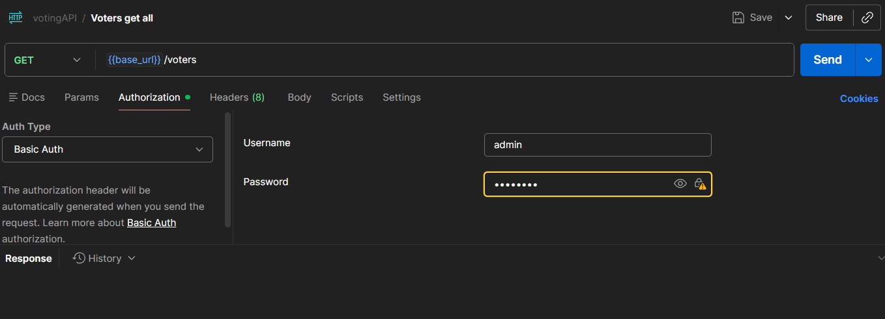
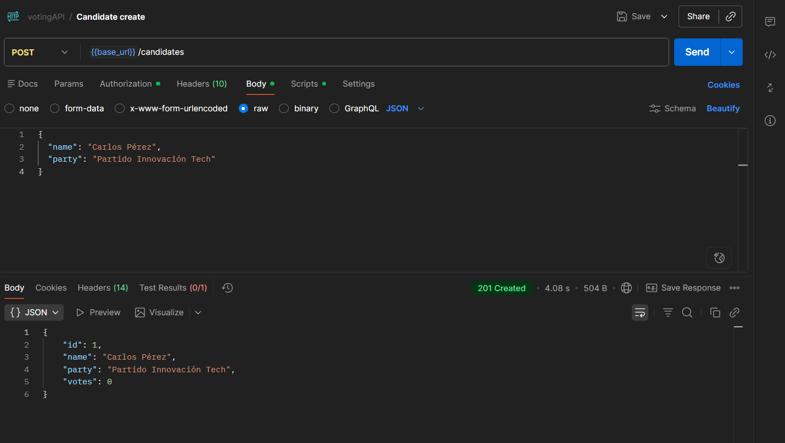
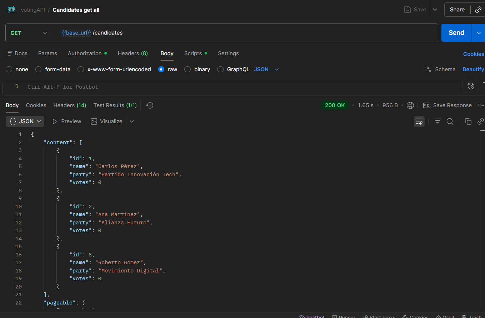
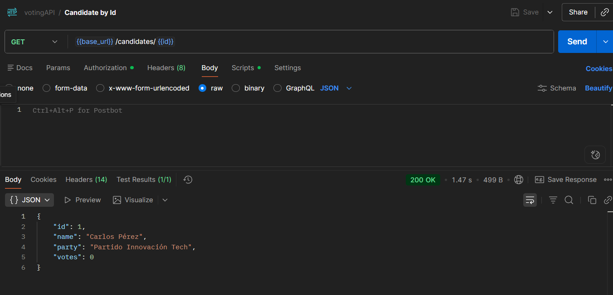
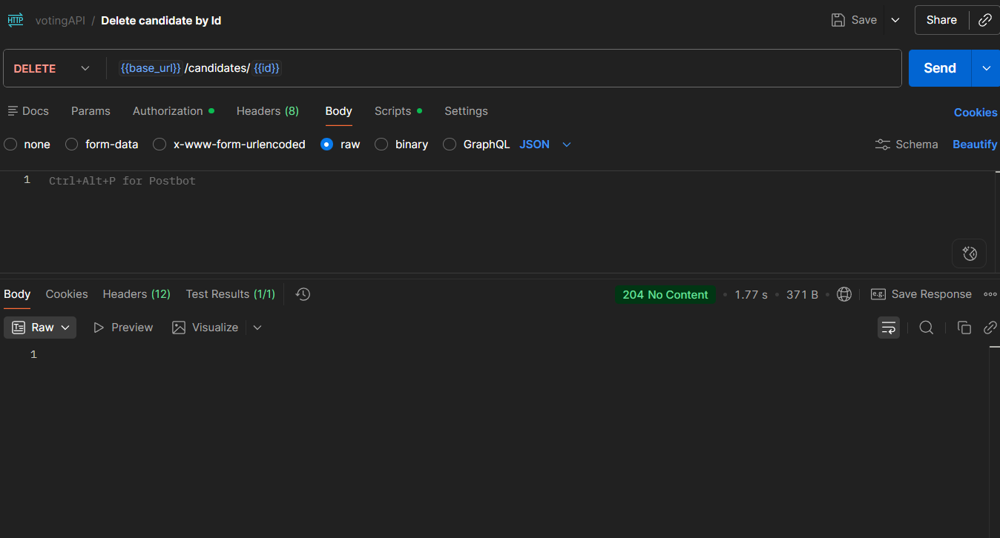

### Votantes y Paginación
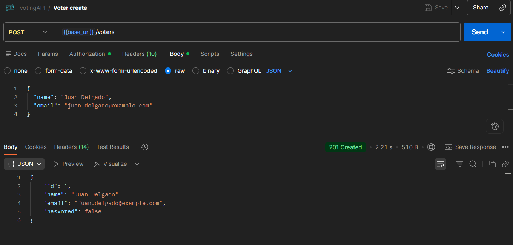

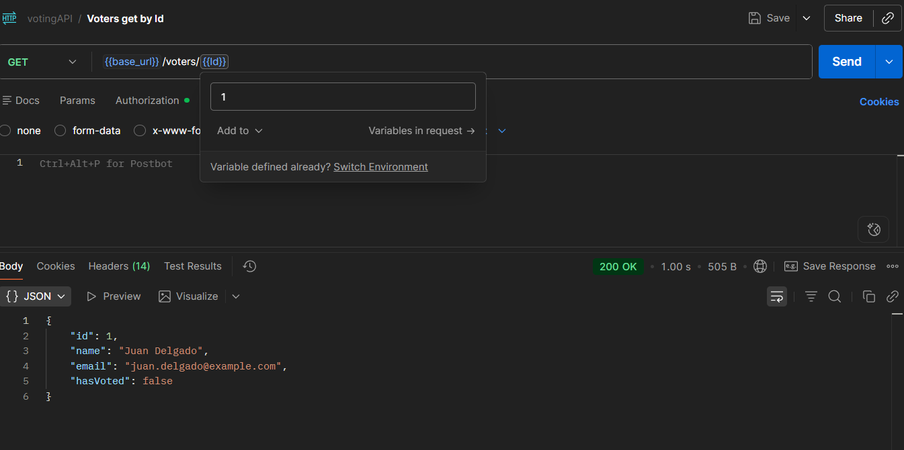

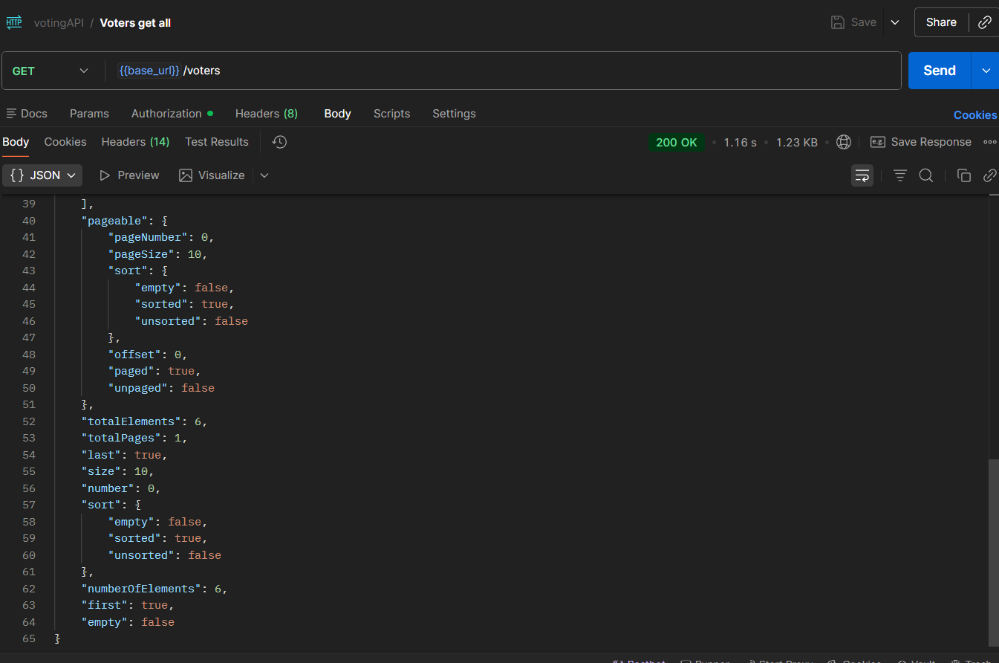

### Votos y Estadísticas Generadas
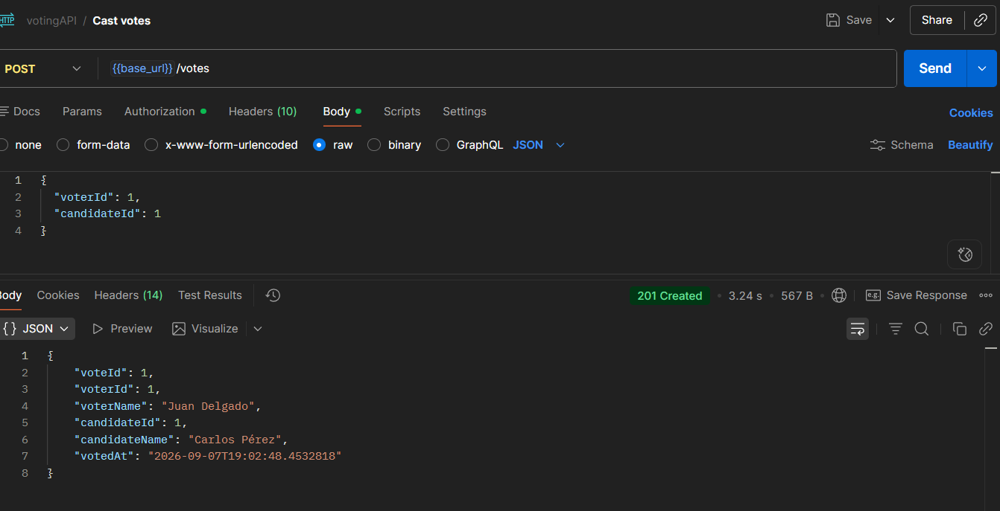
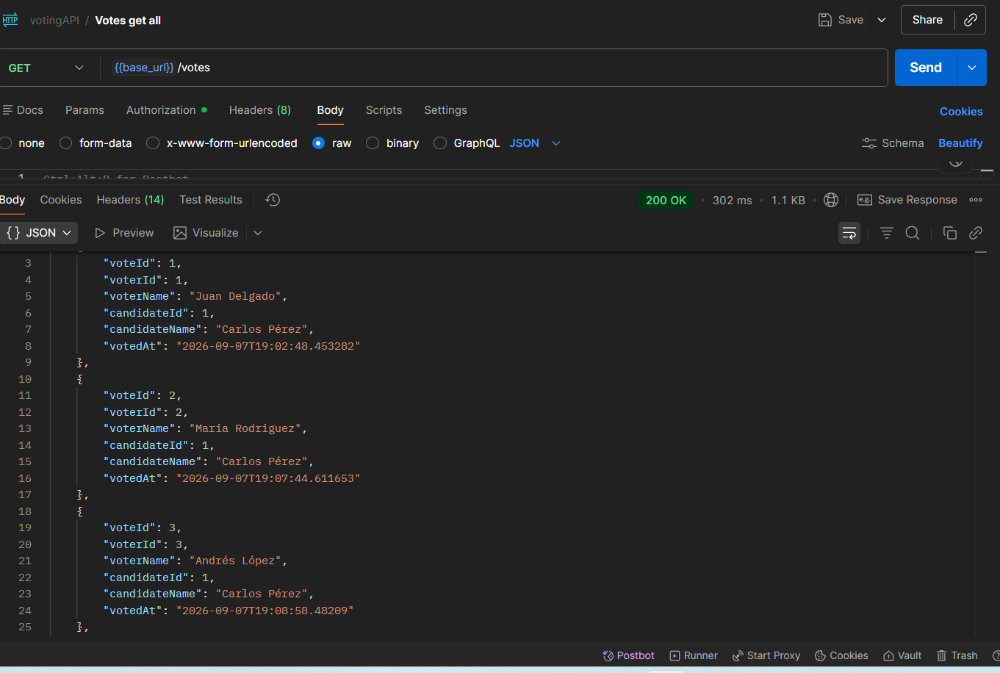
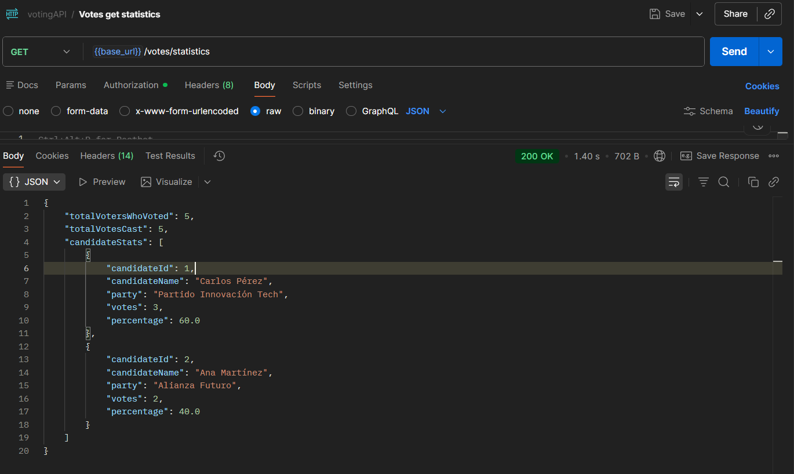

### Control de Excepciones y Reglas de Negocio
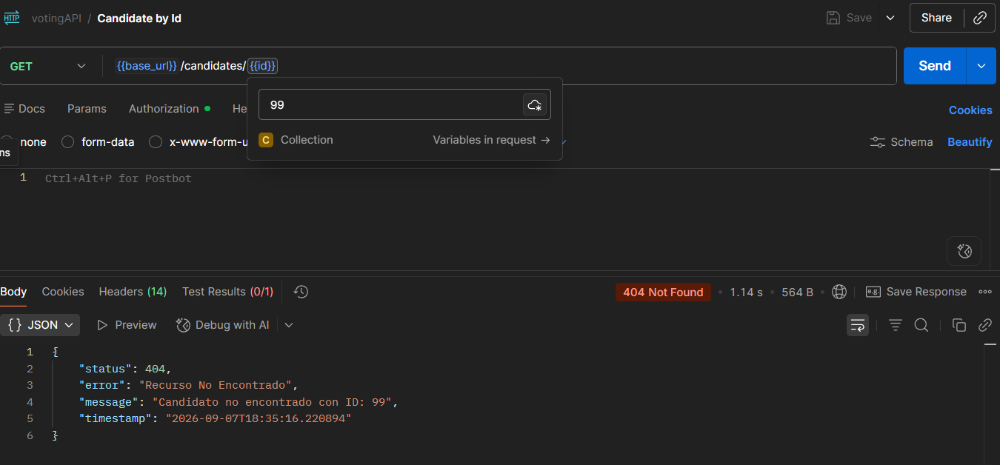
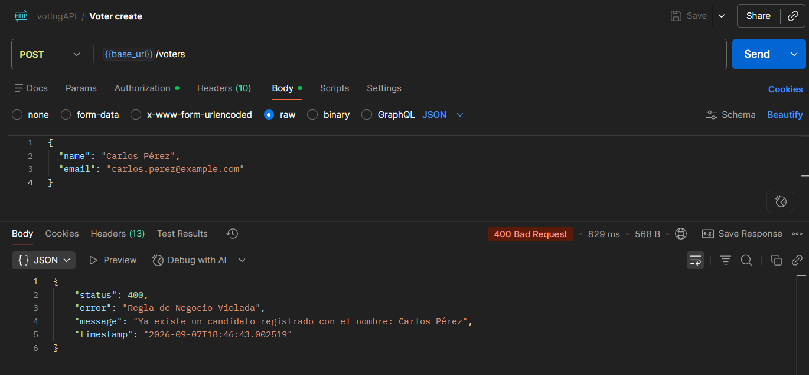
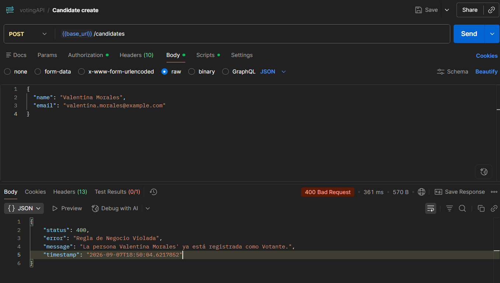
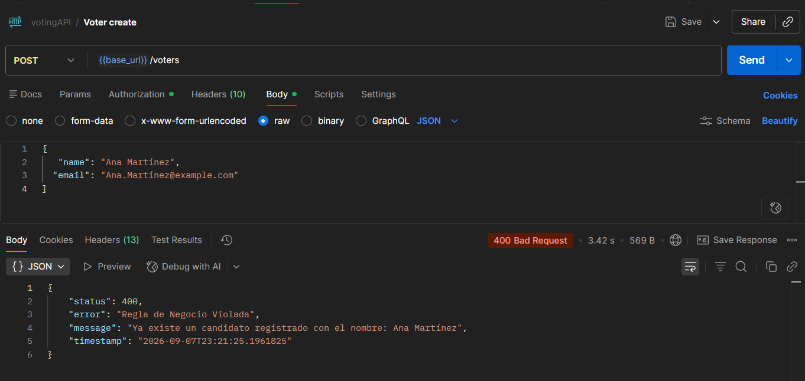
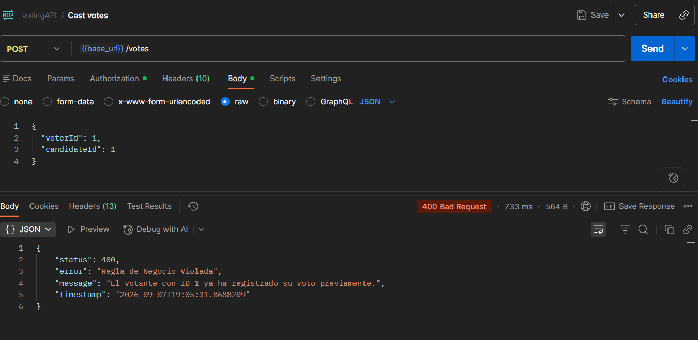
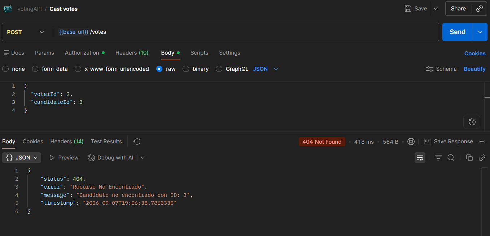

### Persistencia y Documentación Swagger
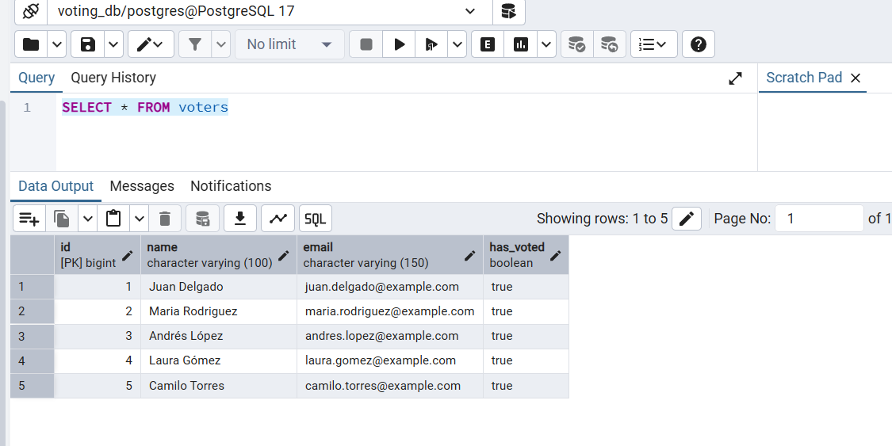
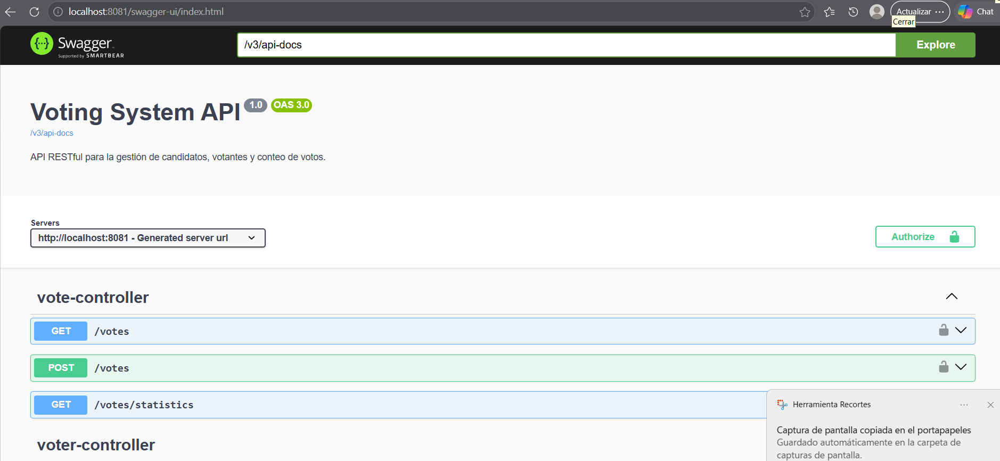

---

## 🚀 Guía de Instalación y Ejecución Local

### Prerrequisitos

* **JDK 21** instalado y configurado.
* **PostgreSQL** activo en el puerto 5432.
* **Apache Maven** 3.8+.

### 1. Configurar la Base de Datos

Crea una base de datos en PostgreSQL llamada `voting_db`. Ajusta tus credenciales en `src/main/resources/application.properties`:

```properties
spring.datasource.url=jdbc:postgresql://localhost:5432/voting_db
spring.datasource.username=postgres
spring.datasource.password=tu_contraseña

spring.jpa.hibernate.ddl-auto=update
spring.jpa.show-sql=true
spring.jpa.properties.hibernate.format_sql=true